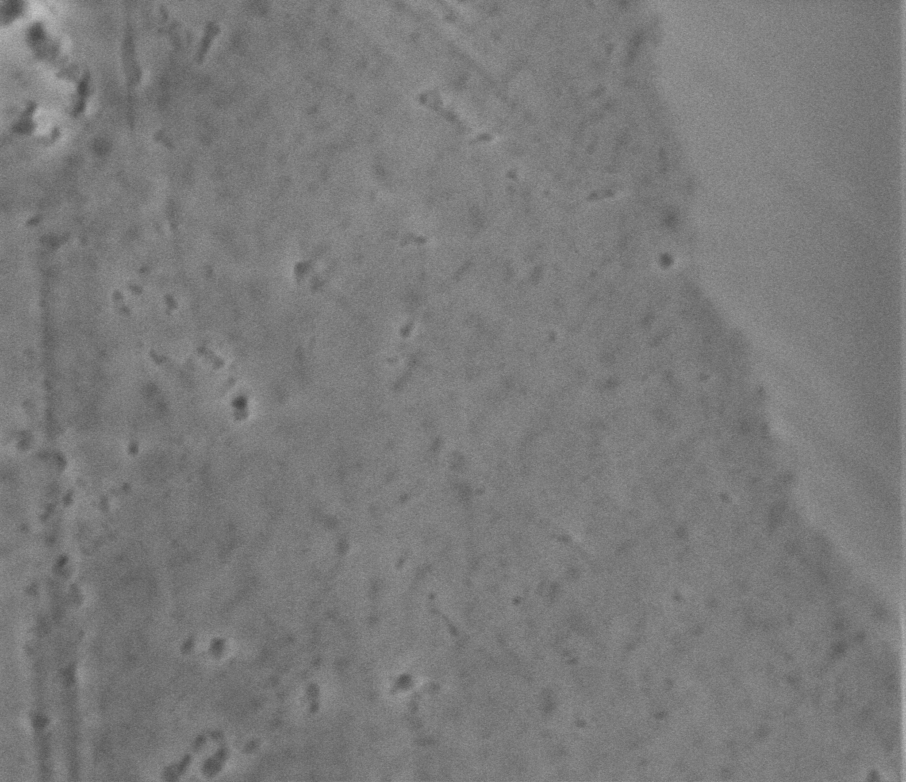
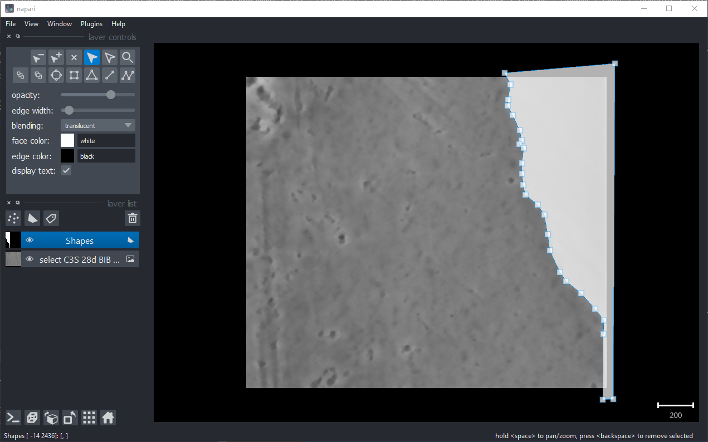
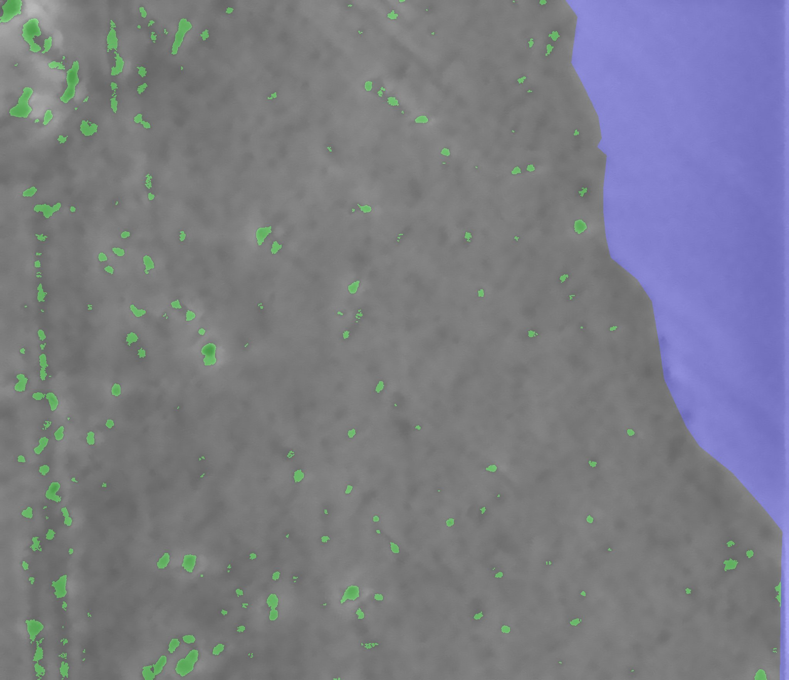

# Supported Manual Segmentation

Python script to manually segment C-S-H phases of low contrast SE images and automatically segment the pores within the selection.



## Script options

```
usage: python ./supported_manual_segmentation.py [-h] [-o] [-c] [-b] [-m] [-s] [-r] [-l:] [-d]

-h,                  : show this help
-o,                  : setting output directory name [processed]
-l,                  : limit pixel scaling [processed]
-c                   : correct the diameter values with the factor 4/Pi [Krumbein 1935]
-b                   : assume the images are already binary (black background, white objects)
-m                   : enable multithreaded processing
-s                   : summarize the data of all images
-r                   : show resulting image
-d                   : show debug output
```

## Usage and program procedure

At first select the folder which contains the images.
Then, the script denoises the image using the non-local-means algorithm provided by OpenCV and calculate the non-local threshold indroduced by Phansalkar et al. (DOI: [10.1109/ICCSP.2011.5739305](https://doi.org/10.1109/ICCSP.2011.5739305)).
In the then appearing napari window, you have to select the area which has to be excluded from the analysis.



To do this, select the `shapes` layer, press (P) or select the button with the triangle symbol and add the polygon along the phase to ignore as shown in the image above.
After that, close the window and continue with the next image.
A subfolder `\processed_nc\` will be created within the working directory, including the image without the microscope scalebar (only for FEI, and thermofischer SEMs), a binary image with the manual segmentation and a binary image with the segmented pores. Additionaly a SEM image, overlayed with the manual segmentation (blue) and the segmented pores (green) will be provided with a CSV which contains the pore size distribution.



## Corresponding paper

This script has been created for the analysis explained in `Argon Broad Ion beam sectioning and high resolution scanning electron microscopy imaging of hydrated alite`, to be published in Cement and Concrete Research in 2021 by Florian Kleiner, Christian Matthes and Christiane Rößler, Bauhaus-Universität Weimar

## Requirements

This script was tested with Python 3.9

`pip install -r requirements.txt`

It may be possible than newer versions of napari trow warnings due to the way of calling it.
Nevertheless, this script at least works with napari version 4.8 .